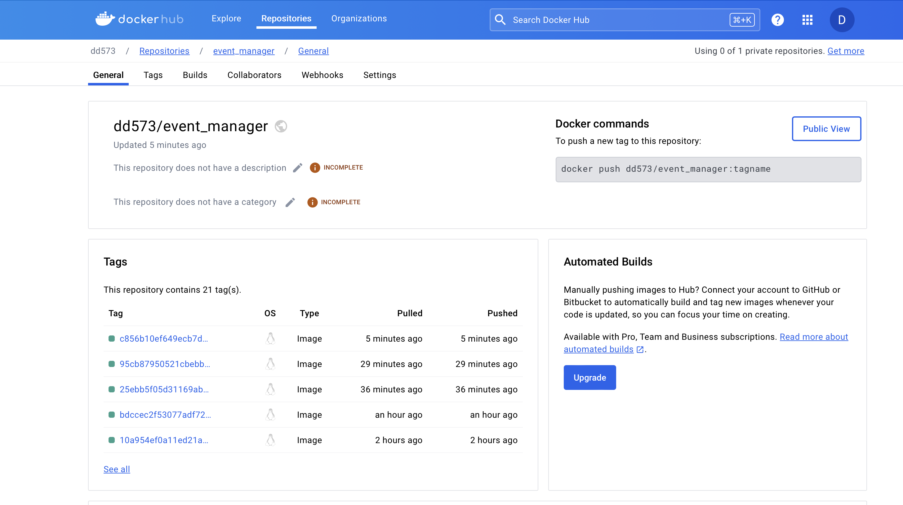
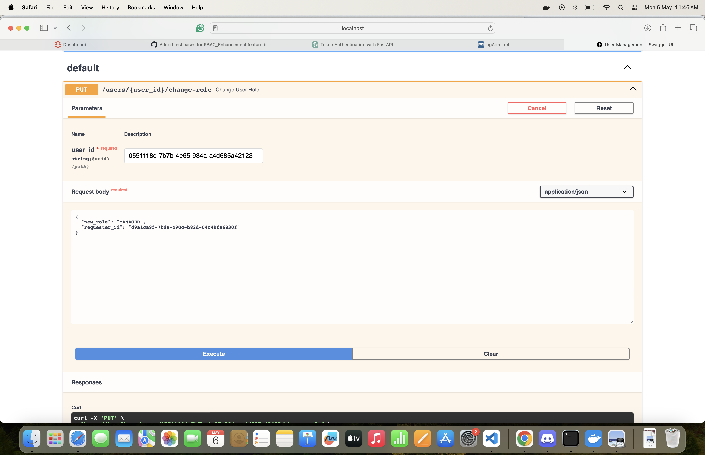
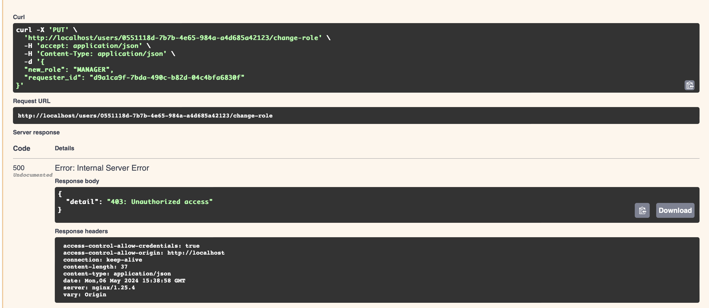
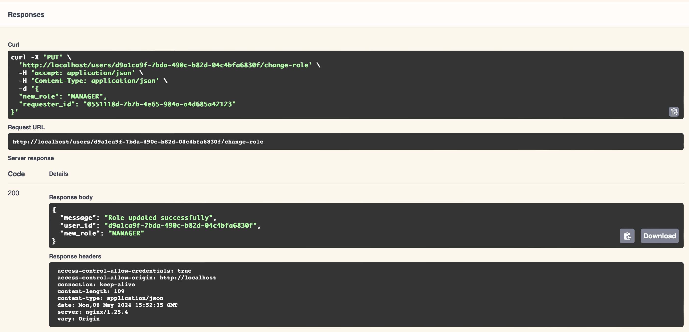
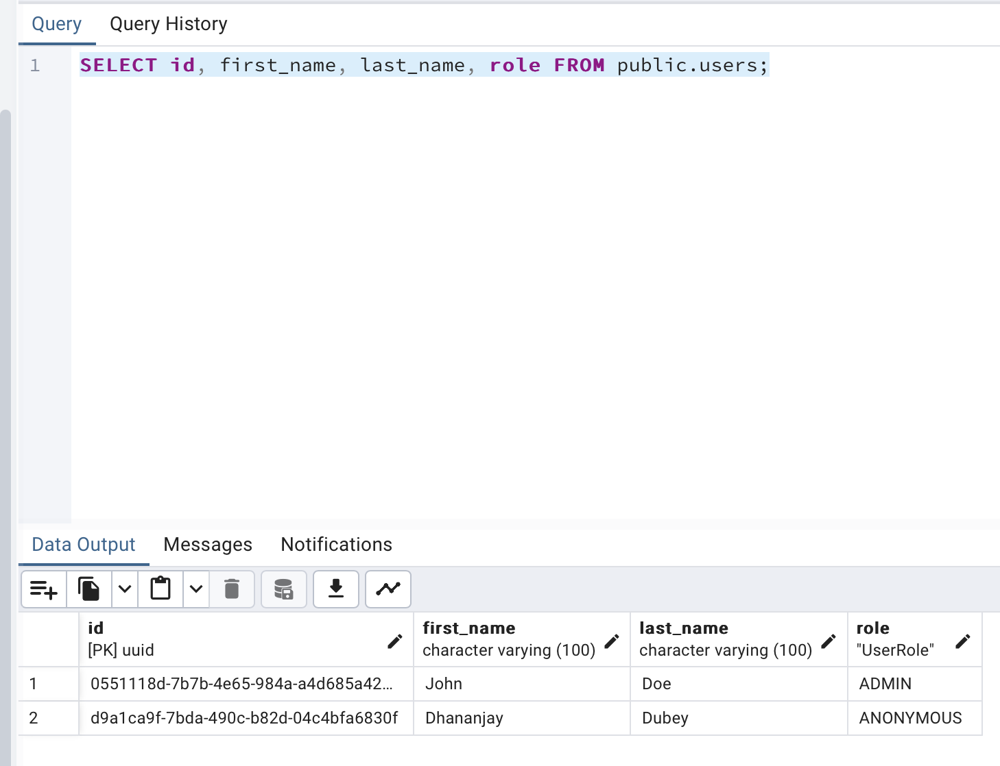
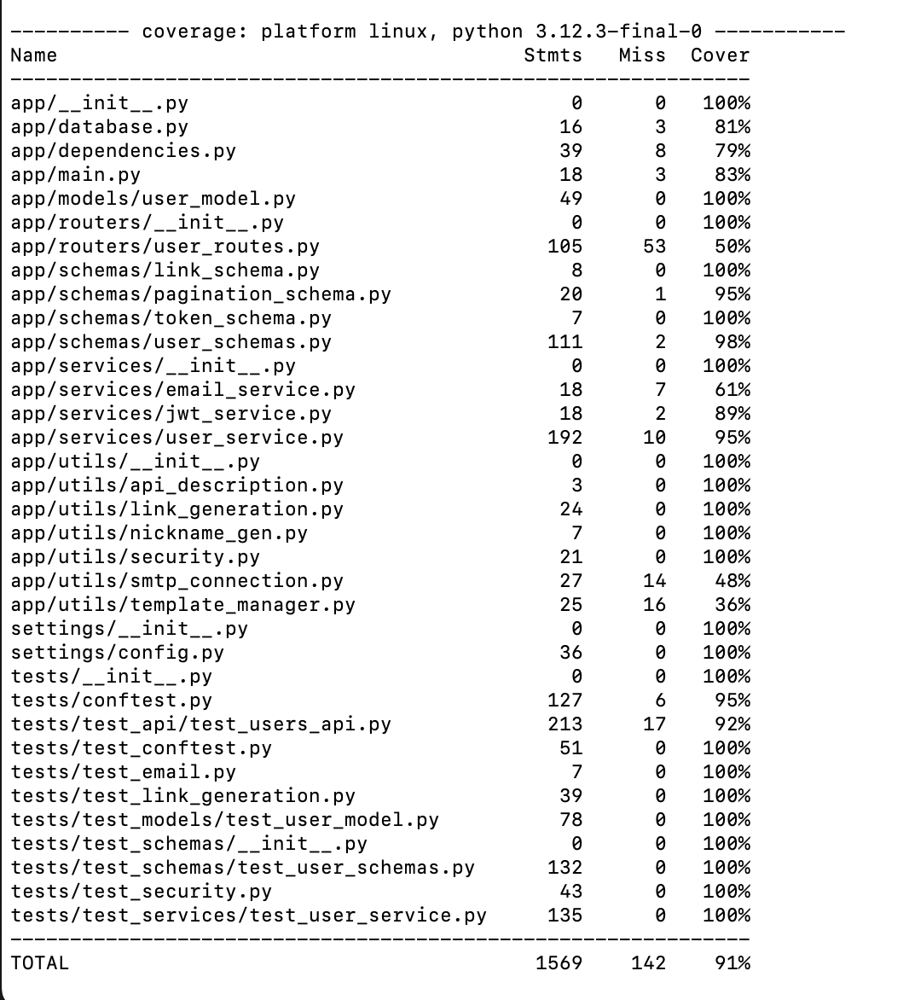

# The User Management System Final Project:

## Issues List:
- [Issue_1]https://github.com/dd573Njit/Final_Project_user_management/pull/1
- [Issue_2]https://github.com/dd573Njit/Final_Project_user_management/pull/2
- [Issue_3]https://github.com/dd573Njit/Final_Project_user_management/pull/3
- [Issue_4]https://github.com/dd573Njit/Final_Project_user_management/pull/4
- [Issue_5]https://github.com/dd573Njit/Final_Project_user_management/pull/5
- [Issue_6]https://github.com/dd573Njit/Final_Project_user_management/pull/6

## [Dockerhub:](https://hub.docker.com/repository/docker/dd573/event_manager/general)

## RBAC Enhancement Feature (New Feature Implementation):
- Implemented /users/{user_id}/change_role api where it will take user_id whose role has to be changed. The Request Body will contain new_role(the new role the user will get) and the requester_id(the id of admin because only admin will have the authority to change the role).

## Test Coverage:
